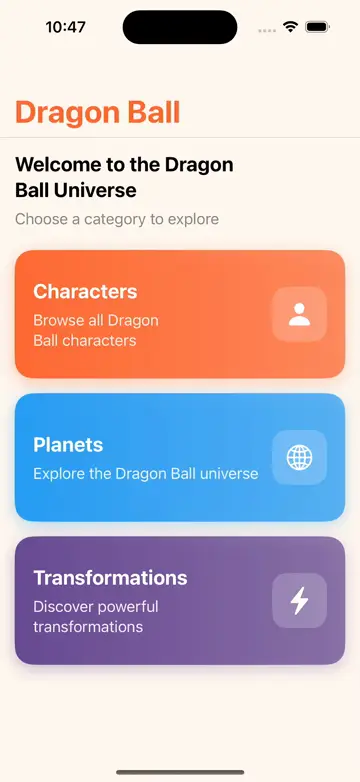

# KDragonBall - Kotlin Multiplatform Dragon Ball App

[](https://github.com/filipebatista/KDragonBall/actions/workflows/ci.yml)
[](https://kotlinlang.org)
[](LICENSE)

A Kotlin Multiplatform (KMP) application showcasing Clean Architecture principles through a Dragon Ball information app. Features shared business logic for Android (Jetpack Compose) and iOS (SwiftUI) with real-time API integration.

## Demo

| Android | iOS |
|:-------:|:---:|
|  |  |

## Features

### Dashboard
- **Hub Navigation** - Central dashboard to access all app sections
- **Dragon Ball Theme** - Custom color scheme inspired by the Dragon Ball universe

### Characters
- **Character List** - Browse all Dragon Ball characters with images and details
- **Search Characters** - Find your favorite characters by name
- **Character Profiles** - View detailed information including:
  - Power stats (Ki, Max Ki)
  - Race and gender
  - Affiliation (Z Fighter, Villain, etc.)
  - Origin planet
  - Transformations gallery
- **Fullscreen Image Viewer** - Pinch to zoom and pan character images

### Planets
- **Planet List** - Explore planets from the Dragon Ball universe
- **Planet Details** - View planet information and characteristics

### Transformations
- **Transformation List** - Browse all character transformations
- **Transformation Details** - View transformation stats and images

### General
- **Splash Screen** - Smooth app launch experience with Dragon Ball branding
- **Live API Integration** - Real-time data from Dragon Ball API
- **Pull to Refresh** - Update data with a simple pull gesture
- **Infinite Scrolling** - Automatic pagination when scrolling
- **Cross-Platform** - Shared business logic between Android and iOS
- **Offline Support** - In-memory caching for improved performance

## Project Structure

The project follows **Package-by-Feature** organization with Clean Architecture layers within each feature:

```
KDragonBall/
├── shared/                              # Kotlin Multiplatform shared module
│   └── src/
│       ├── commonMain/kotlin/com/example/kdragonball/shared/
│       │   ├── core/                    # Shared infrastructure
│       │   │   ├── di/CoreModule.kt     # Core DI (HttpClient, DataSource)
│       │   │   ├── model/               # Shared models (PaginatedResponse)
│       │   │   └── network/             # HTTP client, DragonBallApiDataSource
│       │   ├── feature/                 # Feature modules
│       │   │   ├── character/           # Character feature
│       │   │   │   ├── data/            # CharacterDataSource, CharacterRepositoryImpl
│       │   │   │   ├── domain/          # Character, CharacterError, CharacterRepository, use cases
│       │   │   │   ├── presentation/    # CharacterListViewModel, CharacterDetailViewModel
│       │   │   │   └── di/              # CharacterModule.kt
│       │   │   ├── planet/              # Planet feature (same structure)
│       │   │   └── transformation/      # Transformation feature (same structure)
│       │   └── di/Modules.kt            # Aggregates all feature modules
│       ├── commonTest/                  # Shared unit tests (mirrors feature structure)
│       │   └── kotlin/
│       │       ├── core/testutil/       # TestBuilders, FakeClock
│       │       └── feature/
│       │           ├── character/       # Character tests + FakeCharacterRepository
│       │           ├── planet/          # Planet tests + FakePlanetRepository
│       │           └── transformation/  # Transformation tests + FakeTransformationRepository
│       └── iosMain/                     # iOS-specific code
├── androidApp/                          # Android application
│   └── src/main/kotlin/.../android/
│       ├── ui/screen/                   # Composable screens
│       ├── ui/component/                # Reusable Compose components
│       └── ui/theme/                    # Material 3 theme
├── iosApp/                              # iOS application (SwiftUI)
│   ├── iosApp/Views/                    # SwiftUI views
│   ├── project.yml                      # XcodeGen configuration
│   └── Podfile                          # CocoaPods dependencies
└── gradle/libs.versions.toml            # Centralized version catalog
```

## Architecture

This project implements **Clean Architecture** with three distinct layers organized by feature:

```
┌─────────────────────────────────────┐
│     Presentation (ViewModels)       │  UI state, events, user actions
├─────────────────────────────────────┤
│     Domain (Use Cases, Entities)    │  Pure Kotlin, business logic
├─────────────────────────────────────┤
│     Data (Repositories, API)        │  Network, caching, data sources
└─────────────────────────────────────┘
```

**Key Principle:** Domain layer has NO platform dependencies - it's pure Kotlin.

### Domain Layer (Pure Kotlin)
- **Entities**: `Character`, `Transformation`, `OriginPlanet`, `Planet`, `PaginatedResponse`
- **Error Handling**: Arrow `Either<Error, T>` for type-safe error handling
- **Repository Interfaces**: `CharacterRepository`, `PlanetRepository`, `TransformationRepository`
- **Use Cases**:
  - `GetCharacters` - Retrieve paginated characters
  - `GetCharacterDetails` - Fetch detailed character information
  - `SearchCharacters` - Search characters by name
  - `GetPlanets` - Retrieve paginated planets
  - `GetPlanetDetails` - Fetch planet details
  - `GetTransformations` - Retrieve transformations
  - `GetTransformationDetails` - Fetch transformation details

### Data Layer
- `DragonBallApiDataSource` implementation (Ktor-based)
- Repository implementations with caching strategy
- `HttpClientProvider` for network configuration

### Presentation Layer
- **ViewModels**: Shared ViewModels for list and detail screens
- **UI States**: Immutable state classes for each screen
- **Event Handling**: Using SharedFlow for one-time events
- **Infinite Scrolling**: Automatic pagination

### Platform UIs
- **Android**: Jetpack Compose with Material 3 and Jetpack Navigation
- **iOS**: SwiftUI with SKIE integration for StateFlow observation

## Key Technologies

| Technology | Purpose |
|------------|---------|
| Kotlin Multiplatform | Cross-platform shared code |
| Ktor | HTTP client for API integration |
| kotlinx.serialization | JSON serialization |
| Arrow | Functional error handling (Either) |
| AndroidX ViewModel | KMP-compatible ViewModels |
| SKIE | Swift/Kotlin interoperability |
| Koin | Dependency injection |
| Jetpack Compose | Android UI (Material 3) |
| Jetpack Navigation | Android navigation |
| SwiftUI | iOS UI |
| Coil | Async image loading (Android) |
| XcodeGen | iOS project generation |
| CocoaPods | iOS dependency management |

## Building

### Prerequisites

- **Android**: Android Studio, JDK 17+
- **iOS**: Xcode 15+, CocoaPods, XcodeGen

Install iOS tools:
```bash
brew install xcodegen
sudo gem install cocoapods
```

### Android

```bash
# Build debug APK
./gradlew :androidApp:assembleDebug

# Install on connected device/emulator
./gradlew :androidApp:installDebug
```

### iOS

```bash
# Build shared framework
./gradlew :shared:linkPodDebugFrameworkIosSimulatorArm64

# Generate Xcode project (required after cloning or project.yml changes)
cd iosApp
xcodegen generate

# Install CocoaPods dependencies
pod install

# Open workspace in Xcode
open iosApp.xcworkspace

# Or build from command line
xcodebuild -workspace iosApp.xcworkspace -scheme iosApp \
  -destination 'platform=iOS Simulator,name=iPhone 16' \
  -configuration Debug build
```

### Run Tests

```bash
./gradlew :shared:allTests
```

## iOS ViewModel Integration

This project follows the [official Android KMP ViewModel guide](https://developer.android.com/kotlin/multiplatform/viewmodel) with SKIE for enhanced Swift interoperability.

### Key Components

**1. ViewModelStoreUtil (Kotlin - iosMain)**

Extension function to retrieve ViewModels from Swift with generics support:
```kotlin
@OptIn(BetaInteropApi::class)
fun ViewModelStoreOwner.viewModel(
    modelClass: ObjCClass,
    factory: ViewModelProvider.Factory,
    key: String?,
    extras: CreationExtras? = null,
): ViewModel {
    val vmClass = getOriginalKotlinClass(modelClass) as? KClass<ViewModel>
        ?: error("modelClass isn't a ViewModel type")
    val provider = ViewModelProvider.create(this, factory, extras ?: CreationExtras.Empty)
    return key?.let { provider[key, vmClass] } ?: provider[vmClass]
}
```

**2. IosViewModelStoreOwner (Swift)**
```swift
class IosViewModelStoreOwner: ObservableObject, ViewModelStoreOwner {
    var viewModelStore = ViewModelStore()

    func viewModel<T: ViewModel>(
        key: String? = nil,
        factory: ViewModelProviderFactory,
        extras: CreationExtras? = nil
    ) -> T {
        return try viewModel(modelClass: T.self, factory: factory, key: key, extras: extras) as! T
    }

    deinit { viewModelStore.clear() }
}
```

**3. Usage in SwiftUI with SKIE Observing**
```swift
struct CharacterListView: View {
    @StateObject private var viewModelStoreOwner = IosViewModelStoreOwner()

    var body: some View {
        let viewModel: CharacterListViewModel = viewModelStoreOwner.viewModel(
            factory: ViewModelFactories.shared.characterListViewModelFactory
        )

        Observing(viewModel.uiState) { uiState in
            // SwiftUI views react to state changes automatically
            List(uiState.characters) { character in
                CharacterRow(character: character)
            }
        }
    }
}
```

### Benefits

- **Official Pattern**: Follows Android's recommended KMP ViewModel approach
- **Proper Lifecycle**: ViewModels cleared automatically when view deinitialized
- **SKIE Observing**: Declarative StateFlow observation in SwiftUI
- **Type Safe**: Generic ViewModel retrieval with compile-time safety
- **No Wrappers**: Direct StateFlow observation without intermediate classes

## Code Quality

### ktlint - Kotlin code style
```bash
./gradlew ktlintCheck   # Check code style
./gradlew ktlintFormat  # Auto-format code
```

### SwiftLint - Swift code style
```bash
cd iosApp
swiftlint lint          # Check code style
swiftlint --fix         # Auto-fix issues
```

## API

This app uses the [Dragon Ball API](https://web.dragonball-api.com/) created by [Antonio Alvarez](https://github.com/intentodepirata):

| Endpoint | Description |
|----------|-------------|
| `GET /characters` | Paginated list of characters |
| `GET /characters/{id}` | Character details by ID |
| `GET /planets` | Paginated list of planets |
| `GET /planets/{id}` | Planet details by ID |
| `GET /transformations` | List of transformations |
| `GET /transformations/{id}` | Transformation details by ID |

## Resources

- [Dragon Ball API](https://web.dragonball-api.com/)
- [Android KMP ViewModel Guide](https://developer.android.com/kotlin/multiplatform/viewmodel)
- [Arrow Documentation](https://arrow-kt.io/)
- [SKIE Documentation](https://skie.touchlab.co/)
- [XcodeGen Documentation](https://github.com/yonaskolb/XcodeGen)
- [Koin Documentation](https://insert-koin.io/)
- [Kotlin Multiplatform](https://kotlinlang.org/docs/multiplatform.html)

## Author

**Filipe Baptista** - [@filipebatista](https://github.com/filipebatista)

## License

This project is licensed under the Apache License 2.0 - see the [LICENSE](LICENSE) file for details.

### Third-Party Licenses

- **App Icon**: The Dragon Ball themed app icon is used under the Apache License 2.0.
- **Dragon Ball API**: Data provided by [Dragon Ball API](https://web.dragonball-api.com/)
